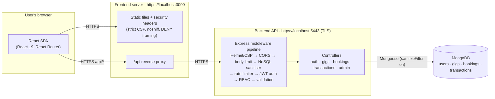
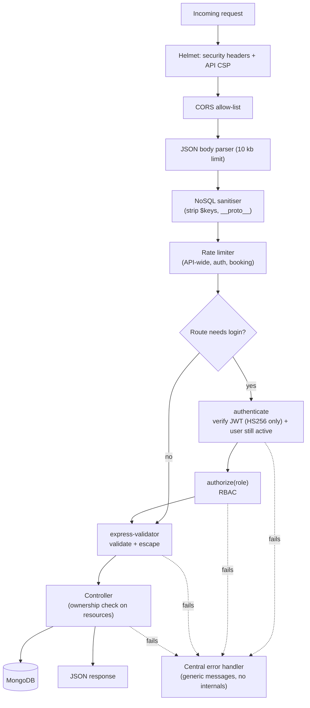
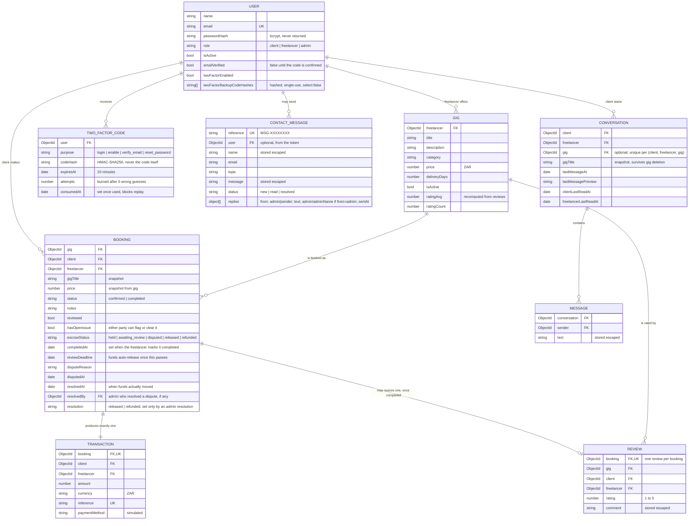

# HustleHub+

A secure freelance marketplace built with the **MERN** stack (MongoDB, Express, React, Node.js). Freelancers advertise services ("gigs"), clients browse and book them, and every booking produces a transaction record so freelancers can see what they have earned.

> **Status: Part 2 – Secure Stack.** Part 1 delivered the secure authentication backend. Part 2 (this version) adds the MongoDB database, marketplace features, role-based access control, hardened security controls, the React frontend and automated tests. Part 3 will add tax estimates, the financial dashboard, logging, Docker and CI/CD.

| | |
|---|---|
| **Team (Group 1)** | Gongo Nobesuthu (ST10545758) · Yanga Bulane (ST10546237) · Sphamandla Godwill Nyanda (ST10543720) |
| **GitHub** | https://github.com/SG-NYANDA/HustleHub-.git |
| **Part 2 demo video** | https://youtu.be/B9SPJAS1410?si=BYKNhRlxuMm34qSe |

---

## Contents

1. [Intended users](#1-intended-users)
2. [Features](#2-features)
3. [Architecture](#3-architecture)
4. [Project structure](#4-project-structure)
5. [Running the project](#5-running-the-project)
6. [API reference](#6-api-reference)
7. [Role-based access control](#7-role-based-access-control)
8. [Security measures](#8-security-measures)
9. [Testing](#9-testing)
10. [What changed since Part 1](#10-what-changed-since-part-1)
11. [Payments: simulated for this demo](#11-payments-simulated-for-this-demo)
12. [Escrow: holding funds until confirmed or reviewed](#12-escrow-holding-funds-until-confirmed-or-reviewed)
13. [Design decisions, trade-offs and known limitations](#13-design-decisions-trade-offs-and-known-limitations)

---

## 1. Intended users

| Role | Who they are | What they can do |
|---|---|---|
| **Client** | Someone who wants to hire | Browse and search gigs, book a gig, see their bookings and payment records |
| **Freelancer** | Someone offering a service | Create, edit, pause and delete **their own** gigs, see bookings made with them, mark work completed, track income |
| **Admin** | Platform operator | See all users, gigs and transactions; disable/enable users; remove gigs that break the rules |

Anyone can register as a client or freelancer. **Admin accounts cannot be created through the public API**; they are seeded by someone with server access (see [Running the project](#5-running-the-project)).

## 2. Features

- Registration and login with bcrypt-hashed passwords and JWT sessions
- **Mandatory email verification.** Every new account starts unverified; registering sends a 6-digit code and the account has no working session until it is entered. The code is only ever logged to the backend terminal - never shown in the browser, the same as a forgotten-password code - unless real email (SMTP) is configured, in which case it's emailed instead. Logging in before verifying re-issues a fresh code rather than ever letting an old one through
- **A real six-box code entry**, not one text field: type a digit and the cursor jumps to the next box on its own; backspace on an empty box jumps back and clears the one before it; pasting a full code (or an email client/password manager autofilling one) fills every box at once. On a correct code the whole form disappears, replaced by a drawn-in green check and a confirmation message - the account is already signed in underneath by that point (see the note on `onSuccess` in `components/CodeStep.jsx`), so the visible check is a real confirmation, not a delay tacked on for looks
- **Two-factor authentication (email codes), opt-in per account** from Security settings (in the account menu): turn it on, confirm with an emailed code, and get 8 one-time backup codes shown once. From then on, logging in needs the password *and* a fresh emailed code (or a backup code if you can't reach your email). Turning it off needs the password again. A half-finished login (right password, no code yet) is given a token scoped only to "verify the code" - it cannot be used to reach any real page, which was confirmed by deliberately trying
- **Forgot / reset password.** Requesting a reset gives the exact same response whether or not the email is registered, and takes the same time either way, so the endpoint can't be used to find out who has an account. The code that arrives is single-use and attempt-limited like every other code in the app
- Role-based access control (client / freelancer / admin) enforced on the API and mirrored in the UI
- Freelancers manage gigs (create, update, view, delete) and can only touch their own
- **Landing page first, forms second.** Visitors arrive on the home page, which carries all the information and leads to "Create free account" / "Log in". Login and register are single, focused cards with no marketing text beside them; "Start hiring" and "Start selling" open the register form with that account type pre-selected (`/register?role=client|freelancer`; any other value, including `admin`, is ignored)
- **Contact the team:** the Help centre and a top-of-page "Contact us" link both lead to a Contact page where anyone (logged in or not) can send a message. It is validated, rate limited and spam-trapped; the sender gets a reference number (e.g. `MSG-4FB6D2E2`); a new enquiry pushes a **live badge** onto every connected admin's nav instantly, with no reload. Admins read and reply from an inline form right in the admin console (the reply is emailed to the sender and kept as a visible thread under the message, alongside a plain `mailto:` link for a quick manual reply), and mark messages new / read / resolved. A signed-in sender sees their own past messages **and any reply, right in the app** under a "Your messages" section on the Contact page - not only by email - with a live badge of their own the moment the team replies, and can **follow up on the same thread** ("The team" vs "You", in order) if a reply didn't actually fix the problem - which reopens the message and pushes a fresh live badge to admins, the same as a brand-new one. Logged-in people have their name and email pre-filled; other pages link to it with the topic already chosen (e.g. a disabled account)
- **Real-time chat between a client and a freelancer.** From a gig page (as a client), "Message the seller" opens a live conversation - reopening it later continues the same thread rather than starting a new one. Delivered over a Socket.IO connection authenticated exactly like the REST API (same JWT check, same "always re-read role/active status from the database" rule, and a half-finished-login token is rejected here too, confirmed by trying), so a message sent by either side - even the plain REST fallback endpoint - arrives instantly on the other person's screen if they have the Messages page open, with a typing indicator and a live unread badge in the nav, no polling or reload. Freelancers can only reply within a conversation a client already started, never cold-message one
- **Custom pages for every scenario**, built on one shared layout so they feel like the same site (see the table in section 8b): 404 not found (with search), 403 wrong account type (with "log in with a different account"), login required and session ended (explained on the login page, then back to where you were), disabled account, 500 crashed page (a crash never leaves a blank screen and leaks nothing technical), and error panels with **Try again** for "can't reach the server", "too many requests" and server errors, an offline banner, and empty lists that point to the next step
- A public **home page** (search, live category counts, top-rated gigs, how it works) and **public browsing**: anyone can look around before signing up; booking needs a client account, and after logging in you are returned to the gig you were viewing
- **Gig pages** with the seller's public profile (member since, orders completed, rating), a price/order box, a **Message the seller** button, and reviews with a star breakdown
- **Reviews and ratings**: after a freelancer marks a booking completed, the client can rate it 1 to 5 stars, once. Averages appear on every gig card and drive the "Top rated" sort
- Search, category chips, sorting and pagination driven by the address bar, so results can be bookmarked and shared
- Site chrome: header search, account menu (with a **Security settings** link), a **Messages** link with a live unread badge, mobile menu, footer, help centre (FAQ), privacy and terms pages, skeleton loaders, toast confirmations and per-page browser titles
- **Simulated payments** (section 11): booking a gig walks through a review step and a demo card-entry step (card number checked with the same Luhn algorithm real forms use, expiry and CVC validated client-side) before confirming instantly. Nothing typed into the card form is ever sent to the server or stored anywhere - it exists purely so the flow feels like a real checkout. The booking and its `Transaction` are created together on the server the moment payment "succeeds", and no real money ever moves
- Freelancer income tracking (total earned, number of paid bookings, average per booking, recent payments)
- **Admin console** with a real overview dashboard: headline totals (users by role, gigs, bookings, money moved, unread messages), a 14-day transaction trend chart, gigs-by-category and bookings-by-status breakdowns, a combined recent-activity feed (new users, bookings, messages), and a **one-click CSV report** (one row per user: gigs listed, bookings, money earned or spent) - alongside user enable/disable, gig moderation, all transactions, and a **Messages inbox with inline replies**. Every list (Users, Gigs, Transactions, Messages) has a **live search box** - by name, email, role, gig title, freelancer, transaction reference, or a message's own reference number (e.g. `MSG-072FE2AA`) - so a long list never has to be scrolled through by eye
- **Follow up, rate, and flag an issue, from either side of a booking.** Every booking (client or freelancer) has a **Follow up** button that opens the Contact page with that specific booking's context already typed in, and a **Report an issue / Issue resolved** toggle either party can flip - visible to both people on the booking and reflected in the admin report. A completed booking's **Rate experience** is the existing 1-5 star review, just labelled for what it actually does
- A plain, professional interface: a flat warm background, white cards with hairline borders, one deep-green accent colour, and no gradients, glows or floating decoration. Details that remain: the login/register card closes in on its cut corners and reopens as the other form, gig cards use a flat muted colour and icon per category, an income total that counts up, a perforated receipt ticket, and a payment card that fills in live as you type. All motion respects `prefers-reduced-motion`
- **Escrow-style payments.** A booking's money isn't simply "paid" the instant it's created - it's held by the platform (`escrowStatus: 'held'`), and only reaches the freelancer once the client confirms the work or a configurable review window quietly expires. See [section 12](#12-escrow-holding-funds-until-confirmed-or-reviewed) for the full lifecycle
- Security controls throughout: validation, sanitisation, rate limiting, Helmet + Content Security Policy, HTTPS, safe error handling
- Automated tests: a 314-request Postman/Newman API suite (more once the rate-limit requests execute) and 346 frontend tests across 29 files (Vitest + React Testing Library)

## 3. Architecture

### System overview


<details>
<summary>Mermaid source</summary>



</details>

**System boundaries**

| Boundary | What crosses it | Protection |
|---|---|---|
| Browser ⇄ frontend server | HTML, JS, CSS, fonts, API calls | HTTPS; strict CSP means only same-origin scripts/styles/fonts/connections are allowed |
| Frontend server ⇄ API | JSON requests with `Authorization: Bearer <JWT>` | HTTPS; CORS allow-list; rate limits |
| API ⇄ MongoDB | Queries built by Mongoose | Validated input only; `$`-operator keys stripped; `sanitizeFilter`; passwords are hashes; DB is never exposed to the browser |

### Request pipeline (every API call)


<details>
<summary>Mermaid source</summary>



</details>

### Data model


<details>
<summary>Mermaid source</summary>



</details>

## 4. Project structure

```
hustlehub-plus/
├── backend/                     Node.js + Express API
│   ├── src/
│   │   ├── app.js               Express app: Helmet/CSP, CORS, sanitiser, limiters, routes
│   │   ├── server.js            Connects to MongoDB, then starts the HTTPS server
│   │   ├── config/              env.js (validated env vars), db.js (Mongoose connection)
│   │   ├── models/              User, Gig, Booking, Transaction, Review, ContactMessage, TwoFactorCode,
│   │   │                        Conversation, Message (Mongoose schemas)
│   │   ├── controllers/         auth, gig, booking, transaction, admin, twoFactor, emailVerification,
│   │   │                        passwordReset, conversation
│   │   ├── services/            otpService.js - shared engine behind every one-time email code;
│   │   │                        chatService.js - the one place a chat message is ever created, used by
│   │   │                        both REST and the socket handler; socketService.js - holds the Socket.IO
│   │   │                        instance so any controller can push a live event to a signed-in user
│   │   ├── sockets/             chatSocket.js - Socket.IO server: JWT-authenticated exactly like the
│   │   │                        REST API, message:send/message:read/typing events
│   │   ├── routes/              Route wiring: which middleware guards which endpoint
│   │   ├── middleware/          authenticate (+ optional; rejects pending verify/2FA tokens), authorize (RBAC),
│   │   │                        validators, sanitizeInput, rateLimiter, errorHandler
│   │   └── utils/               token (JWT, incl. pending tokens), password (bcrypt), twoFactor (codes/backup
│   │                            codes), mailer (SMTP + dev fallback), socketRateLimiter (chat, native -
│   │                            sockets never pass through Express middleware), escrow (review deadline +
│   │                            lazy auto-release, §12), AppError, constants, money, ratings
│   ├── scripts/
│   │   ├── generateCert.js      Creates the local self-signed TLS certificate
│   │   ├── seedAdmin.js         Creates the first admin account
│   │   └── runNewman.js         One-command API test runner
│   └── certs/                   key.pem / cert.pem (git-ignored)
├── frontend/                    React (Vite) single-page app
│   ├── src/
│   │   ├── api/                 fetch client + one function per endpoint
│   │   ├── context/             AuthContext (session state), ChatContext (one Socket.IO connection for
│   │   │                        the whole app, unread badge, subscribe/sendMessage/markRead/setTyping)
│   │   ├── components/          NavBar (search + account menu + live Messages badge), Footer, AuthShell
│   │   │                        (corner transition), GigCard, GigForm, BookingDialog (review + simulated
│   │   │                        card entry + confirmation), PaymentFields, CardPreview, StarRating,
│   │   │                        ReviewForm/ReviewList, Avatar, Toast, Skeleton, CodeBoxes,
│   │   │                        CodeStep (shared code-entry step), TrendChart, BreakdownBars, …
│   │   ├── pages/               Home, Browse, GigDetail (incl. Message the seller), Login, Register,
│   │   │                        ForgotPassword, ResetPassword, AccountSecurity (2FA), Messages (chat),
│   │   │                        MyGigs, Bookings, Income, Payments, Admin (incl. reply-in-place),
│   │   │                        Help/Privacy/Terms, Contact
│   │   ├── utils/               validation, card helpers (brand/Luhn/expiry), formatting,
│   │   │                        token store, text decoding
│   │   ├── styles/              index.css (design tokens + components)
│   │   └── test/                Vitest + React Testing Library tests
│   └── vite.config.js           HTTPS dev/preview server, /api proxy, security headers
└── postman/
    ├── HustleHub-Part2.postman_collection.json   Part 2 suite (used by Newman)
    ├── HustleHub-Local.postman_environment.json
    ├── HustleHub-Auth.postman_collection.json    Part 1 suite (still passes)
    └── reports/                 Newman HTML/JSON reports (generated, git-ignored)
```

## 5. Running the project

### Prerequisites

- **Node.js 20.19+ or 22+** (developed on 22)
- **MongoDB** – either [MongoDB Community Server](https://www.mongodb.com/try/download/community) running locally, or a free [MongoDB Atlas](https://www.mongodb.com/atlas) cluster
- Git Bash / a terminal

### 5.1 Backend

```bash
cd backend
npm install
cp .env.example .env          # then edit .env (see below)
npm run gen-cert              # creates certs/key.pem + certs/cert.pem (self-signed, for localhost)
npm run seed:admin            # creates the admin account defined in .env
npm start                     # https://localhost:5443
```

Edit `backend/.env`:

| Variable | Purpose |
|---|---|
| `JWT_SECRET` | **Required.** Generate one: `node -e "console.log(require('crypto').randomBytes(48).toString('hex'))"`. The server refuses to start with the placeholder value. |
| `MONGODB_URI` | **Required.** e.g. `mongodb://127.0.0.1:27017/hustlehub` or your Atlas connection string |
| `CORS_ORIGIN` | Allowed frontend origin(s). Default `https://localhost:3000` |
| `ADMIN_EMAIL`, `ADMIN_PASSWORD`, `ADMIN_NAME` | Used only by `npm run seed:admin`. Password needs ≥ 12 characters, a number and an uppercase letter |
| `RATE_LIMIT_*` | Optional overrides for the rate limits, including `RATE_LIMIT_CONTACT_MAX` for the contact form, `RATE_LIMIT_OTP_MAX` shared by 2FA, email verification and password reset, and `RATE_LIMIT_CHAT_MAX` for chat messages (defaults in [Security](#8-security-measures)) |
| `REVIEW_WINDOW_HOURS` | How long a client has to release or dispute a completed booking before funds auto-release to the freelancer (§12). Default `72` (3 days); set something small (e.g. `1` or a fraction like `0.05` for ~3 minutes) to demo the auto-release without waiting days |
| `SMTP_HOST` / `SMTP_PORT` / `SMTP_SECURE` / `SMTP_USER` / `SMTP_PASS` / `MAIL_FROM` | Optional. Leave blank to run in demo mode - login-2FA and enable-2FA codes are shown on screen as well as logged to the console; registration and password-reset codes are only ever logged to the console. Fill in to send all of them as real email instead |
| `TWO_FACTOR_TOKEN_EXPIRES_IN` | How long the "enter your code" step stays open after a correct password (default `10m`) |

Health check: `curl -k https://localhost:5443/api/health` (`-k` because the certificate is self-signed).

### 5.2 Frontend

```bash
cd frontend
npm install
npm start          # builds the app and serves it at https://localhost:3000 with the STRICT CSP (recommended)
# or
npm run dev        # hot-reloading dev server at https://localhost:3000 (slightly relaxed CSP for hot reload)
```

Open **https://localhost:3000**. Your browser will warn about the self-signed certificate the first time: choose *Advanced → Proceed to localhost*. (The frontend proxies `/api` to the backend, so this is the only warning.)

Both servers must be running. The frontend reuses `backend/certs`, so run `npm run gen-cert` first.

### 5.3 Try it

1. Register a **freelancer** - you'll land on a "check your email" step. The 6-digit code is never shown on screen; check the terminal running the backend for it, and enter it to finish signing up, then create a gig on *My gigs*.
2. Log out, register a **client** the same way, open *Browse gigs* and book the gig - review the order, then enter (simulated) card details on the payment step; pay with `4242 4242 4242 4242`, any future expiry, any CVC (see §11).
3. Log back in as the freelancer: the booking appears under *Bookings*, and *Income* shows the earnings once you mark it completed.
4. Optional: open the account menu → **Security settings** and turn on two-factor authentication. Log out and back in to see the extra code step, and note the 8 backup codes shown once - save one to try the "Use a backup code" link on a later login.
5. Try **Forgot your password?** from the login page with the client's email; the reset code is, again, only in the backend terminal - never shown on screen - until SMTP is configured.
6. Log in with the seeded admin account to open *Administration* → **Overview** for the dashboard (trend chart, category/status breakdowns, recent activity), or **Messages** if you tried the Contact page.

### 5.4 Sending real email (optional)

By default the app runs in demo mode: registration and password-reset codes are only ever logged to the backend terminal (never shown in the browser); login-2FA and enable-2FA codes are shown on screen as well as logged to the terminal. No inbox is needed for any of this - the whole app works with no setup at all. To send genuine email instead - so a real code or admin reply actually lands in someone's inbox - fill in five lines in `backend/.env`. The free, no-signup way to do this is a **Gmail App Password**:

1. Turn on 2-Step Verification on the Google account you want to send from, if it isn't already (**myaccount.google.com/security**).
2. Go to **myaccount.google.com/apppasswords**, create a new app password (any name, e.g. "HustleHub+"), and copy the 16-character password it gives you.
3. In `backend/.env`, set:
   ```
   SMTP_HOST=smtp.gmail.com
   SMTP_PORT=587
   SMTP_SECURE=false
   SMTP_USER=your.address@gmail.com
   SMTP_PASS=the16characterapppassword
   MAIL_FROM=HustleHub+ <your.address@gmail.com>
   ```
   (`SMTP_PASS` is the app password from step 2, not your normal Google password - Gmail rejects the normal one for this.)
4. Restart the backend (`npm start`). From then on, 2FA codes stop appearing on screen, and every code and admin reply is actually emailed instead of only reaching the backend terminal.

Any other SMTP provider works the same way - only the host/port/credentials change. A second free, no-signup-beyond-an-account-you-already-have option is a personal Outlook/Hotmail address (`smtp-mail.outlook.com`, port `587`, your normal Outlook password).

This is entirely optional for marking or demoing the project: every feature already works fully in demo mode, and this section only matters if you want the emails themselves to be real.

## 6. API reference

Base URL: `https://localhost:5443/api`. All responses use `{ "success": boolean, "message"?: string, "data"?: … }`. Routes marked **public** need no login (an expired or invalid token there is simply treated as anonymous); every other route needs `Authorization: Bearer <token>`.

| Method | Path | Access | Purpose |
|---|---|---|---|
| GET | `/health` | public | Liveness check |
| POST | `/auth/register` | public · rate-limited | Register as `client` or `freelancer`; answers with `{ requiresVerification: true, verifyToken, maskedEmail }`, never a real token or a dev code - see §2 |
| POST | `/auth/login` | public · rate-limited | Log in. Returns a real JWT only if the account is verified and (if on) 2FA is satisfied; otherwise answers `{ requiresVerification }` (no dev code - same as register) or `{ requiresTwoFactor, twoFactorToken, devCode? }` |
| POST | `/auth/verify-email` | **public** · rate-limited | Finish registration `{ verifyToken, code }` → real JWT |
| POST | `/auth/verify-email/resend` | **public** · rate-limited | Send a fresh code `{ verifyToken }` (45s cooldown) |
| POST | `/auth/forgot-password` | public · rate-limited | `{ email }` → **always** the same response, real account or not (no enumeration) |
| POST | `/auth/reset-password` | **public** · rate-limited | `{ email, code, newPassword }`; wrong email and wrong code give an identical generic failure |
| GET | `/auth/2fa/status` | any logged-in user | `{ twoFactorEnabled }` |
| POST | `/auth/2fa/enable/request` | any logged-in user · rate-limited | Sends a code to confirm you can read this inbox |
| POST | `/auth/2fa/enable/confirm` | any logged-in user · rate-limited | `{ code }` → turns 2FA on, returns 8 backup codes **once** |
| POST | `/auth/2fa/disable` | any logged-in user | `{ password }` - re-authenticates before turning it off |
| POST | `/auth/2fa/verify` | **public** · rate-limited | Finish a 2FA login `{ twoFactorToken, code }` or `{ twoFactorToken, backupCode }` → real JWT |
| POST | `/auth/2fa/resend` | **public** · rate-limited | Send a fresh login code `{ twoFactorToken }` (45s cooldown) |
| GET | `/users/me` | any logged-in user | Current user |
| POST | `/contact` | **public** (rate limited) | Send a message to the team `{ name, email, topic?, message }`; answers with a reference number only |
| GET | `/contact/mine` | signed in | The caller's own past messages, with replies and an `unreadReply` flag - never someone else's, even an anonymous message they genuinely sent |
| PATCH | `/contact/mine/seen` | signed in | Marks every reply the caller has received as seen |
| POST | `/contact/mine/:id/reply` | signed in, sender of that message | Follow up on a message that's already been replied to `{ text }`; reopens it (`status` back to `new`) and notifies admins live, the same as a brand-new message |
| GET | `/gigs` | **public** | Browse **active** gigs with ratings. Query: `q`, `category`, `minPrice`, `maxPrice`, `sort` (`newest`/`top`/`price_asc`/`price_desc`), `page`, `limit` (≤ 50) |
| GET | `/gigs/categories` | **public** | Live-gig count per category |
| GET | `/gigs/mine` | freelancer | My gigs (including paused) |
| GET | `/gigs/:id` | **public** | One gig plus the seller's public profile (name, member since, live gigs, completed orders, rating). Paused gigs: owner/admin only, otherwise `404` |
| GET | `/gigs/:id/reviews` | **public** | Reviews (newest first, reviewer's name only) with the average and a per-star breakdown |
| POST | `/gigs` | freelancer | Create a gig |
| PATCH | `/gigs/:id` | freelancer **owner** | Update fields / pause (`isActive`) |
| DELETE | `/gigs/:id` | freelancer **owner** | Delete a gig |
| POST | `/bookings` | client · booking-rate-limited | Book and pay for a gig `{ gigId, notes? }` → booking + transaction created together (payment is simulated) |
| GET | `/bookings` | client / freelancer / admin | Role-scoped list (own bookings; admin: all) |
| GET | `/bookings/:id` | participant or admin | One booking |
| PATCH | `/bookings/:id/complete` | freelancer on that booking | Mark completed - starts the client's review window (§12) |
| POST | `/bookings/:id/release` | **client on that booking**, only while `awaiting_review` | Release the held funds to the freelancer early, before the review window expires |
| POST | `/bookings/:id/dispute` | **client on that booking**, only while `awaiting_review` | Flag a problem `{ reason }`; funds stay held for an admin to resolve instead of releasing or auto-releasing |
| POST | `/bookings/:id/review` | **client on that booking** | Rate a **completed** booking `{ rating: 1-5, comment? }`, once |
| PATCH | `/bookings/:id/issue` | client or freelancer on that booking | Flag or clear a problem with it `{ hasOpenIssue: boolean }` - either side of the booking, never an outsider |
| GET | `/transactions` | client / freelancer / admin | Role-scoped transactions |
| GET | `/transactions/income` | freelancer | Own income summary |
| GET | `/admin/stats` | admin | Platform totals |
| GET | `/admin/users` | admin | All users (`?role=`) |
| PATCH | `/admin/users/:id/status` | admin | Enable/disable a user `{ isActive }` |
| GET | `/admin/gigs` | admin | All gigs |
| DELETE | `/admin/gigs/:id` | admin | Remove any gig |
| GET | `/admin/transactions` | admin | All transactions |
| GET | `/admin/escrow` | admin | Every booking whose funds are currently held (`held` or `awaiting_review`), plus the total amount held. Auto-releases any expired review window first (§12) |
| GET | `/admin/disputes` | admin | Bookings a client has disputed, oldest first |
| POST | `/admin/disputes/:id/resolve` | admin | Resolve a dispute `{ resolution: 'released' \| 'refunded' }` - all-or-nothing, no partial splits |
| GET | `/admin/messages` | admin | Messages from the Contact page, newest first, with a count per status (`?status=new\|read\|resolved`) |
| PATCH | `/admin/messages/:id/status` | admin | Mark a message `{ status: new \| read \| resolved }` |
| POST | `/admin/messages/:id/reply` | admin | Reply `{ text }`; emails the sender and adds the reply to the message's thread |
| GET | `/admin/report` | admin | A CSV download - one row per user, with gigs listed, bookings, and money earned or spent |
| POST | `/conversations` | **client only** | Start (or reopen) a conversation `{ gigId }` - a freelancer replies within one, never cold-starts one |
| GET | `/conversations` | client or freelancer | The signed-in user's own conversations, newest activity first, each with an `unread` flag |
| GET | `/conversations/:id/messages` | a participant only | Up to 50 messages, oldest first (`?before=<ISO date>` to page further back) |
| POST | `/conversations/:id/messages` | a participant only | REST fallback for sending `{ text }` - the live path is the Socket.IO event below, and both go through the same code, so behaviour (and delivery to the other side) is identical either way |
| PATCH | `/conversations/:id/read` | a participant only | Marks the conversation read up to now, for this user's side |

**Real-time chat (Socket.IO, path `/api/socket.io`, same auth rules as above):** connect with `{ auth: { token } }`; `message:send { conversationId, text }` (ack with the stored message or `{ error }`); `message:read { conversationId }`; `typing { conversationId, isTyping }`. The server pushes `message:new`, `conversation:updated` and `typing` to whichever user is on the other side of the conversation, to every tab/device they have open.

**Status codes used:** `200/201` success · `400` malformed request · `401` missing/invalid/expired token (also a pending verify/2FA token used anywhere it shouldn't be) · `403` authenticated but not allowed · `404` not found (also used for other people's bookings and conversations, so ids can't be probed) · `409` conflict (duplicate email, already completed, booking not yet completed, already reviewed, already verified, 2FA already on/off) · `413` body too large · `422` validation failed · `429` rate limit exceeded (includes `retryAfterSeconds` for the resend-cooldown responses) · `500` generic server error.

## 7. Role-based access control

Yes = allowed · No = `403` · Restricted = own records only

| Action | Client | Freelancer | Admin |
|---|:-:|:-:|:-:|
| Browse / view active gigs and reviews | Yes (also without logging in) | Yes | Yes |
| Create gig | No | Yes | No |
| Update / delete a gig | No | Restricted | No (uses moderation route) |
| Book (and simulate paying for) a gig | Yes | No | No |
| List bookings | Restricted (made) | Restricted (received) | Yes, all |
| Mark booking completed | No | Restricted (own gig) | No |
| Release held funds early / dispute a booking | Restricted (own booking, only while awaiting review) | No | No |
| View bookings currently holding funds (Active bookings) | No | No | Yes |
| Resolve a dispute (release or refund) | No | No | Restricted |
| Review a completed booking (once) | Restricted | No | No |
| Flag or clear a booking's issue | Restricted (own booking) | Restricted (own booking) | No |
| Turn 2FA on/off; see own security status | Restricted | Restricted | Restricted |
| Send a message to the team | Yes (also without logging in) | Yes | Yes |
| Follow up on your own message | Restricted (own, signed in) | Restricted (own, signed in) | Restricted (own, signed in) |
| Read / manage messages; reply to one | No | No | Restricted |
| Start a conversation with a freelancer | Restricted (own) | No (replies only, never cold-starts) | No |
| Read / send in a conversation | Restricted (participant only) | Restricted (participant only) | No |
| View transactions | Restricted (paid) | Restricted (earned) | Yes, all |
| Download the platform report (CSV) | No | No | Restricted |
| View income summary | No | Restricted | No |
| Admin routes (`/api/admin/*`) | No | No | Yes |

How it is enforced:

1. `authenticate` verifies the JWT, then **loads the user from the database** and takes the role from there, not from the token. A disabled or demoted account loses access immediately.
2. `authorize(...roles)` rejects a wrong role with `403` (and logs a `[SECURITY]` line).
3. **Ownership checks** in controllers: a freelancer editing someone else's gig gets `403`; bookings and transactions are scoped in the database query itself (`{ client: userId }` / `{ freelancer: userId }`), so other people's rows can never be returned.
4. Request bodies are **whitelisted** (`title`, `description`, `category`, `price`, `deliveryDays`): a client cannot set `freelancer`, `createdAt` or `amount` (mass assignment).

## 8. Security measures

| Threat | Control | Where |
|---|---|---|
| Stolen database / password leak | bcrypt, 12 rounds; `passwordHash` is `select: false` and stripped from every JSON response | `utils/password.js`, `models/User.js`, `utils/toJSON.js` |
| Forged / tampered tokens | HS256 pinned on sign **and** verify (blocks `alg: none`); minimal payload (`id`, `role`); expiry (`JWT_EXPIRES_IN`, default 1h); secret validated at start-up | `utils/token.js`, `config/env.js` |
| Privilege escalation | `admin` cannot be chosen at registration (validator + controller check); admins are seeded by script | `validators.js`, `authController.js`, `scripts/seedAdmin.js` |
| Broken access control / IDOR | `authorize` role checks, ownership checks, DB-level scoping, `404` for others' bookings | `middleware/authorize.js`, controllers |
| Price tampering | Booking price is read from the gig on the server; request `amount`/`price` is ignored | `bookingController.js` |
| Injection (NoSQL) | Body sanitiser strips `$…`/dotted keys; every input validated for type; `isMongoId` on ids; Mongoose `sanitizeFilter` (with internally-built operator filters - `$gte`, `$lte`, `$in` - explicitly marked safe via `mongoose.trusted()`, since `sanitizeFilter` cannot otherwise tell a developer's own operator from an injected one, see §12 for a real bug this caused); regex search input escaped | `sanitizeInput.js`, `resourceValidators.js`, `config/db.js`, `gigController.js`, `adminController.js`, `utils/escrow.js` |
| Stored XSS | Every free-text field is HTML-escaped on input (`escape()`); React escapes on output; the UI decodes the entities back only into text nodes | validators, `frontend/src/utils/text.js` |
| Brute force / abuse | `express-rate-limit`: **auth** 20 / 15 min per IP; **booking** 10 / 15 min per user; **all other API** (broad safety net, deliberately generous so it never masks the specific limiters above under normal heavy use - see §13) 2000 / 15 min per IP. `429` responses carry `Retry-After`, `RateLimit-*` headers and a JSON message with `retryAfterSeconds` | `middleware/rateLimiter.js` |
| User enumeration | Identical `401` message for unknown email and wrong password, with equalised bcrypt timing | `authController.js`, `utils/password.js` |
| Clickjacking, MIME sniffing, downgrade | Helmet: CSP `default-src 'none'; frame-ancestors 'none'`, HSTS, `nosniff`, `Referrer-Policy: no-referrer`, CORP; `Cache-Control: no-store` on all API responses | `app.js` |
| XSS in the SPA | Frontend CSP: `default-src 'self'`; `script-src 'self'`; `style-src 'self'`; `connect-src 'self'`; `object-src 'none'`; `frame-ancestors 'none'`. No inline scripts or styles; fonts are bundled, not loaded from a CDN | `frontend/vite.config.js` |
| Eavesdropping | HTTPS for both servers (local self-signed cert); HTTP requests to the TLS port are rejected | `server.js`, `vite.config.js` |
| Cross-origin abuse | CORS allow-list from `CORS_ORIGIN` | `app.js` |
| Information disclosure | Central error handler returns generic messages; stack traces only in the server log; malformed JSON, oversized bodies, bad ids all map to safe messages | `middleware/errorHandler.js` |
| Oversized payloads | 10 kb JSON limit; per-field length limits | `app.js`, validators |
| Unverified / hijacked accounts | Every account starts unverified; no session is issued until an emailed code is confirmed. Logging in before verifying re-issues a fresh code, invalidating the old one | `authController.js`, `emailVerificationController.js`, `services/otpService.js` |
| Bypassing 2FA mid-login | The token issued between "correct password" and "correct code" carries a `stage` claim (`2fa` or `verify_email`) that `authenticate.js` explicitly rejects everywhere else, so it can never be used to reach a real page - confirmed by deliberately testing it against a protected route before shipping | `utils/token.js`, `middleware/authenticate.js` |
| Guessing / replaying one-time codes | Codes are 6 digits from a CSPRNG, hashed (HMAC-SHA256, not stored in the clear), expire in 10 minutes, burn after 5 wrong guesses, and are marked consumed on success so they can never be reused; backup codes are hashed and removed the moment they are used | `utils/twoFactor.js`, `services/otpService.js`, `models/TwoFactorCode.js` |
| Account-existence enumeration via password reset | `forgot-password` and `reset-password` return the *identical* message whether or not the email is registered or the code is right, with a timing-equalising delay on the "not found" path | `passwordResetController.js` |
| Turning 2FA off without proving it's really you | Disabling requires the account's real password again, not just an active session | `twoFactorController.js` |
| Flooding verification/2FA/reset endpoints | A dedicated rate limiter (`RATE_LIMIT_OTP_MAX`, default 8 / 15 min per IP) sits on every code-verify and code-resend route, on top of the per-code attempt limit and resend cooldown above | `middleware/rateLimiter.js` |
| Public reads stay safe | `optionalAuthenticate` only ever *narrows* what is shown: no token, or a bad one, means anonymous. Paused gigs stay hidden from everyone but their owner and admins; responses never include email addresses; public routes still sit behind the API-wide rate limiter | `middleware/authenticate.js`, `gigController.js` |
| Fake or repeated reviews | A review needs a **completed** booking that belongs to the caller; a unique index allows **one per booking** (races become a safe `409`); rating must be a whole number 1-5; comments are escaped | `bookingController.js`, `models/Review.js` |
| Contact form abuse | Rate limited per IP (default 5 per 15 minutes); every field validated (name 2-80, valid email, topic from a fixed list, message 10-2000) and HTML-escaped before storage; an invisible **spam-trap field** that bots fill in (their message is silently discarded); the sender **cannot set** `status`, `user` or `reference` (the account link comes from the verified token); only a reference number is echoed back; only admins can read the inbox; the reply link is URL-encoded so a crafted email address cannot inject mail headers | `contactRoutes.js`, `contactController.js`, `rateLimiter.js`, `AdminPage.jsx` |
| Faked reply history | Every reply stores which admin sent it (the id from the verified token, never the request body) plus a name snapshot, so the thread can't be forged to look like it came from someone who never sent it | `adminController.js`, `models/ContactMessage.js` |
| Unauthenticated / hijacked chat connections | The Socket.IO handshake is verified exactly like an HTTP request: same JWT check, role and `isActive` re-read from the database on every connection (never trusted from the token), and a pending 2FA/verify-email token is rejected here too (it carries the same `stage` claim `authenticate.js` checks) - confirmed by connecting with no token, a garbage token, and a pending token before shipping | `sockets/chatSocket.js` |
| Reading or sending in someone else's conversation | Every conversation lookup (REST and socket) checks the caller is one of its two participants; a non-participant gets the same `404` a stranger probing a booking id would get, never a `403` that would confirm the conversation exists | `services/chatService.js` |
| Flagging or clearing another person's booking issue | Route-level RBAC blocks anyone but a client or freelancer (a `403`, since the role itself is disallowed); a stranger who *is* one of those roles but isn't on that specific booking still gets `404`, the same ownership pattern used everywhere else in this app | `bookingController.js`, `bookingRoutes.js` |
| Following up on someone else's message to the team | The follow-up lookup is scoped to `{ _id, user: req.user.id }` in one query, not a fetch-then-check - a stranger gets the same `404` an unrelated booking or conversation would give, and this is mutation-tested (stripping the scope down to `{ _id }` alone is caught by two separate assertions) | `contactController.js` |
| Sensitive financial data in the CSV report | Restricted to admins only at the route level; every name is decoded back to plain text before being written out (a stored, HTML-escaped `&amp;` would otherwise show up literally in a spreadsheet) - checked with a mutation test that stripped the decoding step and confirmed the suite catches it | `adminController.js` |
| A freelancer using chat to cold-message clients | Starting a conversation is a client-only route; a freelancer can reply within one that already exists but can never create one | `conversationRoutes.js` |
| Chat message flooding | A per-user rate limit (`RATE_LIMIT_CHAT_MAX`, default 120 / 15 min) is enforced on the REST endpoints via the usual limiter *and*, separately, on the socket path (which never passes through Express middleware) by a small native sliding-window check | `middleware/rateLimiter.js`, `utils/socketRateLimiter.js` |
| Stored XSS in chat | Messages are escaped once, in one shared function used by both the REST and socket send paths, so a message typed either way is sanitised identically (an earlier version escaped it a second time at the REST validation layer too, which silently corrupted the text - caught by a test, described in §13) | `services/chatService.js` |
| Disabled accounts | Checked on every request, so an admin disabling a user takes effect immediately | `authenticate.js` |
| Card data ever reaching this app | Payment is simulated: the demo card form's values live only in that component's React state and are never sent in any request body - there is nothing for the server to log, store, or leak | `components/PaymentFields.jsx`, `components/BookingDialog.jsx` |
| Double-charging / duplicate transactions | A unique index on `Transaction.booking` means a booking can only ever have one transaction, whatever creates it | `models/Transaction.js` |

Front-end specifics: the JWT is kept in `sessionStorage` (cleared when the tab closes), sent only in the `Authorization` header, never rendered or logged; any `401` on an authenticated call logs the user out; only the API's controlled `message` is ever shown to users.

### 8b. Custom pages for different scenarios

| Scenario | What the person sees | Where |
|---|---|---|
| Address does not exist (404) | "We can't find that page", a search box, links home / explore / help | `pages/NotFoundPage.jsx` |
| Gig removed, paused or invalid id | "This gig isn't available" (only for a genuine 404; a network problem is **not** mislabelled as a missing gig) | `pages/GigDetailPage.jsx` |
| Wrong account type (403) | Which account type the page is for, which one you have, and a button to log in with a different account | `components/AccessDenied.jsx` |
| Not logged in | Login page with "Please log in to continue", then returned to the page they wanted | `ProtectedRoute`, `LoginPage` |
| Session rejected by the API (401) | Login page with "Your session has ended, so please log in again" | `AuthContext` (`sessionEnded`) |
| Account disabled by an admin | Its own page with a way to contact the team (a wrong password stays on the login page) | `pages/AccountDisabledPage.jsx` |
| The page crashed while drawing (500) | "Something went wrong" with Reload / Back to home; header and footer stay; recovers when you navigate | `components/ErrorBoundary.jsx`, `pages/ServerErrorPage.jsx` |
| Cannot reach the server / server error / rate limited | A specific message and a **Try again** button, worded by what actually happened | `components/ErrorPanel.jsx`, `DataState.jsx` |
| Browser goes offline | A slim banner that disappears when the connection returns | `components/OfflineBanner.jsx` |
| An empty list | A message plus the next step (e.g. "Explore gigs", "Create your first gig") | `DataState` `emptyAction` |

None of these show stack traces, file paths or raw server responses; only the API's own controlled messages are ever displayed.

## 9. Testing

### 9.1 Backend API tests (Postman + Newman)

The suite lives in `postman/HustleHub-Part2.postman_collection.json`: **314 requests** (more once the rate-limit requests execute - a handful deliberately repeat until they receive `429`), organised into folders. Run `npm run test:api` for the exact current request/assertion counts and pass/fail result from your own machine and database - the numbers below describe what each folder proves, not a specific historical run:

| Folder | What it proves |
|---|---|
| 00 Health & headers | HTTPS, CSP, HSTS, `nosniff`, no `X-Powered-By`, `no-store`, consistent 404 |
| 01 Registration | valid signup for each role (register **then verify**, since no token is issued until the email is confirmed); duplicate email; weak password; missing fields; bad email; **admin role blocked**; XSS escaped (checked once the account is real); NoSQL operator rejected; malformed JSON |
| 01b Email verification | **the pending token cannot be used on a protected route**; wrong code counts down attempts; malformed/non-numeric code; garbage token; logging in before verifying **re-issues a fresh code and kills the old one**; verifying twice is `409`; the resend cooldown |
| 02 Login | valid; wrong password vs unknown user return the **same** message; missing fields; NoSQL injection |
| 02b Forgot / reset password | **identical response for a real vs. non-existent email** (no enumeration, checked byte-for-byte); wrong code gets the same generic failure either way; weak new password rejected; the correct code succeeds; the old password stops working and the new one works; **the same code cannot be reused**; a disabled account cannot be reset even with a plausible code |
| 03 JWT protection | valid / missing / garbage / wrong scheme / **tampered signature** / **forged `alg: none` admin token** |
| 03b Two-factor authentication | enable (wrong/malformed code, correct code issues 8 distinct backup codes), already-on/-off conflicts, login now requires a code, **the pending 2FA token cannot reach a protected route or be reused to verify an email code**, wrong code counts down attempts, resend cooldown, **replaying a used code fails**, a valid backup code works once, **reusing a backup code fails**, disable needs the real password |
| 04 Gigs & RBAC | create/list/browse/filter/update; client & admin forbidden from creating; **mass-assignment ignored**; invalid prices/categories/ids; XSS escaped; **other freelancer blocked from update & delete**; **public browsing** (anonymous OK, bad token = anonymous, no emails leaked); category counts; seller profile; paused gigs hidden from visitors |
| 05 Bookings & transactions | booking creates a transaction record linked to both users (payment is simulated); **tampered amount ignored**; freelancer/admin cannot book; inactive/unknown gig; isolation between users; other users get `404` for someone else's booking; complete-booking rules |
| 05b Reviews & ratings | only the booking's own client can review; **not before completion**; **once per booking**; freelancer/admin forbidden; rating range/type/NoSQL cases rejected; comment escaped; gig rating, top-rated sort and seller rating update; public reviews list; **the issue flag** - either the client or freelancer on that booking can set or clear it, a stranger and an admin (role-blocked, not just ownership-blocked) both cannot, non-boolean values rejected |
| 05c Contact the team | anonymous and logged-in senders; every validation rule; NoSQL/XSS attempts; **mass assignment ignored**; **spam trap stores nothing**; inbox restricted to admins (401/403); status changes; filters; **replying** (RBAC, validation, markup escaped once, the admin is snapshotted, replies accumulate rather than replace, persists on refetch); **"Your messages"** (`/contact/mine`) - strictly scoped to the signed-in sender (a regression test catches a stripped-out scope filter leaking every message to everyone), an anonymous message is never retroactively claimable, unread-reply flag correctness, marking seen; **following up on your own message** - only the sender may (a mutation test confirms a stripped ownership check is caught), validation, reopens the message to `new`, the sender's own follow-up never marks itself unread, and admin sees both sides of the thread in order; the **contact rate limiter** answers 429 |
| 06 Income | totals/average attributed to the right freelancer; zero for others; clients/admins forbidden |
| 07 Admin | admin-only access; user disable takes effect on an existing token; re-enable; can't disable self; gig moderation; the dashboard's role/category/status breakdowns, unread-message count and activity feed; **the 14-day transaction trend always ends on today, not yesterday** (a regression test for a bug caught during manual review - see §13); **the CSV report** - admin-only, the right columns are present, a real known user is actually in it, and names come back decoded rather than left as `&amp;`/`&#x27;` (a mutation test confirms this is actually checked, not just assumed) |
| 07b Chat | client-only start, reused thread rather than duplicated; a freelancer cannot cold-start one; RBAC scoping on list/read/send/mark-read (a non-participant gets `404`, never `403`); unread flag correctness; validation (empty/oversized text, NoSQL, malformed ids/cursor); markup escaped **exactly once** (a regression test for a real double-escaping bug found and fixed - see §13); pagination shape. Real-time delivery itself is proven separately with a genuine two-client `socket.io-client` connection and, in the browser, two live tabs - Newman cannot hold a socket open, so this folder covers everything about chat that a REST client *can* exercise |
| 08 Deleting gigs | owner delete; booking history and income survive |
| 09 Rate limiting | booking, contact, auth **and OTP** limiters all return `429` with `Retry-After`, `RateLimit-*` and `retryAfterSeconds` |

> **Known gap:** the escrow endpoints added since this table was last extended (`/bookings/:id/release`, `/bookings/:id/dispute`, `/admin/escrow`, `/admin/disputes`, `/admin/disputes/:id/resolve` - see [section 12](#12-escrow-holding-funds-until-confirmed-or-reviewed)) are **not yet covered by this Postman collection**. They are exercised by frontend tests (`BookingsPage.test.jsx`, `AdminEscrow.test.jsx`) and were manually verified against a live server, but a dedicated `10 - Escrow & disputes` folder (ownership, RBAC, wrong-state `409`s, and the resolve endpoint's `all-or-nothing` behaviour) has not been added here yet.

Every request also runs collection-level checks: `nosniff` present, `X-Powered-By` absent, and **no stack traces, file paths or driver errors in any response**.

**Run it (one command):**

```bash
cd backend
npm run test:api
```

The runner starts a **separate API instance** on port 5444 against a **separate database** (`hustlehub_test`, same MongoDB server), seeds a test admin, runs Newman, and stops the server. It writes an HTML report to `postman/reports/newman-report.html` (screenshot this as evidence) and exits non-zero if anything fails. It does not touch your development data.

Or import the collection and `HustleHub-Local.postman_environment.json` into Postman and run the folders manually against a running API. Set `adminEmail` / `adminPassword` in the environment to your seeded admin. Run folder **09** last: it deliberately trips the auth rate limiter for your IP for 15 minutes.

### 9.2 Frontend tests (Vitest + React Testing Library)

```bash
cd frontend
npm test
```

346 tests across 29 files (confirmed with a clean `npm install` + `npx vitest run` in this round) covering component rendering and user interaction:

- **Simulated payments (`GigDetailPage`, `BookingsPage`, `PaymentFields`, `CardPreview`, `utils/card`)** – booking a gig walks through review → demo card entry → confirmation inside one dialog; the card form's Luhn/expiry/CVC validation (unit-tested directly in `utils/card.test.js`) gates the Pay button; the server's error is shown and the dialog stays open if the booking request fails; a "Verifying your payment…" pause auto-redirects to the conversation with the freelancer, and a one-time dismissible banner confirms it on the Messages page
- **Escrow (`BookingsPage`, `AdminEscrow`)** – a client sees "Release funds now" / "Report a problem" only while a booking is `awaiting_review`, and a live countdown to the auto-release deadline; releasing shows "Paid out", disputing requires a reason and shows "Awaiting resolution"; a freelancer sees a read-only "Pending payments" summary of what's currently held, never the release/dispute controls (client-only); the admin "Active bookings" tab lists everything currently held with a running total, and "Disputes" lets an admin resolve one (release or refund) with the list correctly emptying afterwards

- **Admin search (`AdminSearch`)** – Users filters live by name, email or role; Gigs by title or freelancer; Transactions by reference, gig, client or freelancer; Messages by its own reference number (e.g. `MSG-072FE2AA`), sender, or the message body itself - each shows a live result count and an honest "no match" message rather than silently showing nothing
- **The CSV report button (`AdminOverview`)** – calls the download function and shows a busy state while it runs, shows the server's reason if it fails
- **Follow up, and flagging an issue (`BookingsPage`)** – Follow up is offered on every booking regardless of status, for both a client and a freelancer, and links to the Contact page with that specific booking's context already typed in (decoded, readable, not left as `&amp;`); Report an issue flips to Issue resolved once flagged and back again when cleared; the server's reason is shown if the toggle fails

- **"Your messages" and the support badge (`ContactPage`, `ChatContext`)** – nothing shown at all to a visitor or to a signed-in person who has never written in (and no flash of an empty panel while the first fetch is still in flight); a past message and its topic/status are readable; a reply from the team appears underneath with markup rendered inert and no admin name shown (just "The team"); an unread reply is marked **"New reply"** and gets marked seen the moment the page opens; a freshly sent message shows up without a page reload; Try again on a failed load; **following up on the same thread** - both sides render labelled "The team"/"You", Reply is offered even before any admin reply exists, sends to the right message and refreshes the thread, won't send empty, shows the server's error and keeps the draft, can be cancelled. `ChatContext`'s badge logic on its own: a client/freelancer's badge comes from their own `contactMine()`, an admin's comes from `adminMessages('new')` instead (never their own sent messages), both refresh on the matching live event (`contact:new` for admins, `contact-reply:new` for a sender) and reset to 0 on logout
- **Chat (`MessagesPage`, `ChatContext`)** – conversation list newest-first with gig/preview; opening a thread loads history and marks it read; a message the person sent themselves is styled as theirs; sending shows it immediately; **a simulated live socket event updates the open thread without any re-fetch** (asserted directly: `listMessages` is called exactly once, proving what follows is a push, not a poll); a live event for a different conversation is correctly ignored; a typing indicator that clears itself; server errors on send keep the draft; empty/error states. `ChatContext` on its own (with `socket.io-client` mocked): connects only when signed in, disconnects and zeroes the badge on logout, the unread badge is computed from the conversation list and refreshed on every live event and on the tab's own read action, `sendMessage`/`markRead` reject cleanly when the socket isn't connected
- **"Message the seller" (`GigDetailPage`)** – offered to a client viewing someone else's gig; starts or reopens the right conversation and navigates there; shows the server's error and stays put if it fails; correctly withheld from the gig's own freelancer, a visitor, and an admin
- **Admin Messages: replying** – opens an inline form naming who it will email and the reference; sends the trimmed text to the right message; won't send an empty reply; shows the server's error and keeps what was typed; can be cancelled; closes and refreshes the list on success; shows the growing reply thread with markup rendered inert; correct singular/plural
- **Six-box code entry (`CodeBoxes`)** – auto-advance to the next box on a digit, backspace-back-and-clear on an empty box, arrow-key navigation, pasting/autofill distributed across the remaining boxes from wherever it lands, disabled state - including the sparse-array bug this caught before it shipped (typing into the last box first used to display in the wrong box entirely; see §13)
- **Email verification & 2FA code steps (`CodeStep`)** – the box input end to end inside a real page, resend with its cooldown message, wrong code shown without losing your place, switching between "enter a code" and "use a backup code", demo-mode code shown on screen for 2FA (never for email verification, which only ever logs to the backend terminal), and the **success animation actually pausing the handoff**: the check and message are confirmed on screen (via fake timers) *before* the page navigates or the next step appears, not just that both eventually happened
- **Login / Register** – validation messages, no API call on invalid input, successful submit, server errors, admin role is not offered, and the card-close transition (skipped for reduced-motion users)
- **Security settings (2FA)** – off by default; turning on walks through request → confirm → the 8 backup codes shown exactly once; turning off asks for the password and shows the server's message if it's wrong; loading and error states
- **Forgot / reset password** – email step, code + new password step, the server's generic wording is shown as-is (never rewritten to imply the account does or doesn't exist), success screen, weak-password rejection
- **Return-to-page (real session)** – after "Log in to book", registering, verifying an email, completing a 2FA login, or being bounced from a protected page, the person lands where they were **and the page actually stays reachable on reload** (uses the real auth provider, not a static mock - the test class that would have caught the `AuthContext` session bug described in §13)
- **ProtectedRoute** – anonymous → login, wrong role blocked, right role allowed, no flash while the session is restored
- **Admin Overview dashboard** – headline totals with role/this-week breakdowns (and correct singular/plural wording), the 14-day trend chart (and its empty-state message when there is truly nothing to show), gigs-by-category and bookings-by-status breakdowns, the recent-activity feed newest-first, loading/error/Try-again
- **NavBar** – links per role, header search, account menu (opens, closes on Escape / outside click, logs out, includes Security settings), mobile menu, **a live Messages unread badge** for chat (correct singular/plural wording, capped at "9+", absent when there is nothing unread, not offered to admins since gig chat isn't something they take part in) and, separately, **a live support badge on Contact us / Administration**: an admin's counts new enquiries, anyone else's counts their own messages with an unread reply, sourced from `contactMine()` or `adminMessages('new')` respectively and never shown at all to a signed-out visitor
- **HomePage** – headline and search, category counts, top-rated gigs, how-it-works, sign-up banner hidden for signed-in users, error tolerance
- **GigDetailPage** – seller profile, reviews (markup rendered inert), who may order (visitor / client / other freelancer / owner / admin), not-found state (the booking + simulated payment flow is covered above)
- **Reviews** – star picker as an accessible radio group, review form (rating required, server errors, cancel), list and per-star bars, `Reviewed` badges, freelancers never offered a review
- **Contact page** – validation, pre-filled details, topic from the link, errors clear as you fix them, exact payload, reference shown, server/rate-limit errors keep your text, no double sending, spam-trap field hidden from people and sent when a bot fills it
- **Admin Messages inbox** – readable list, markup shown as inert text, counts and filters, mark read / resolved / reopen, safe reply link, empty and error states
- **Toasts, Help / Privacy / Terms, Footer, Avatar** – auto-dismiss and manual dismiss, FAQ, honest data statements, footer links
- **GigCard / GigForm** – decoded text, malicious markup rendered inert, booking button only for clients, category cover and icon with a stable artwork per gig, field validation, clean typed payload
- **IncomePage** – totals, decoded titles, empty and error states (the count-up jumps straight to the figure for reduced-motion users)
- **BrowseGigsPage** – public browsing, cards link to their gig, filters read from (and ignore junk in) the address bar, sort by top rated, search, category chips, empty/error states
- **API client** – Bearer header, safe error messages, network failures, auto-logout on `401`
- **Utilities** – entity decoding, formatting, validation rules

### 9.3 Part 1 tests

`postman/HustleHub-Auth.postman_collection.json` (Part 1) still runs unchanged against the new API: **15 of its 20 assertions pass**. The 5 that now fail all expect `/auth/register` and `/auth/login` to return a token immediately, which a fresh, unverified account no longer does - a deliberate trade-off for mandatory email verification, explained in [section 12](#12-design-decisions-trade-offs-and-known-limitations), with the one-line revert if strict Part 1 compatibility is preferred.

## 10. What changed since Part 1

| Area | Part 1 | Part 2 |
|---|---|---|
| Storage | JSON file (`users.json`) | **MongoDB** via Mongoose (users, gigs, bookings, transactions, reviews, messages, one-time codes) |
| Roles | freelancer, client | + **admin** (seeded, not self-registrable); RBAC middleware |
| Account security | password + JWT only | + **mandatory email verification**, **optional 2FA** (email codes + backup codes), **forgot/reset password** with no account enumeration |
| Features | register / login / `me` | gigs CRUD, booking, transactions, income, admin console with a real dashboard, **reviews and ratings** |
| Marketplace | none | **public** home page, browsing and gig pages with seller profiles; search-driven URLs |
| Site chrome | none | header search, account menu (+ Security settings), mobile menu, footer, help / privacy / terms, skeletons, toasts |
| Frontend | none | **React SPA** (Vite) over HTTPS with strict CSP |
| Validation | register/login | all new inputs, ids, query strings, plus NoSQL sanitiser |
| Rate limiting | auth only (fixed) | auth + **booking (per user)** + **contact** + **one-time codes (2FA/verify/reset)** + API-wide, env-configurable, meaningful `429` |
| Security headers | Helmet defaults | explicit CSP (`default-src 'none'` on the API, strict CSP on the SPA), HSTS, no-store |
| JWT | HS256 by default | HS256 **pinned**; role re-read from the database each request; pending verify/2FA tokens explicitly rejected on every real route |
| Errors | generic 500 for parser errors | malformed JSON → 400, cast/duplicate errors mapped safely |
| Login timing | fast for unknown users | bcrypt timing equalised (also applied to forgot-password) |
| Tests | 14-request Postman collection | 314-request Newman suite + 346 frontend tests, one-command runner |

## 11. Payments: simulated for this demo

Payment is deliberately **simulated**, not connected to any real payment processor. This was a considered choice, not an oversight: real card processors (Stripe included) require an account to be based in a supported country, and South Africa - where this project is built and marked - is not currently one of them. Rather than route around that with a workaround account in another country, payment is kept honestly simulated, exactly what a "demo marketplace" for a class project should be.

**How it works:**

1. Booking a gig opens a dialog with two steps: **review** (price, delivery time, notes) and **payment** (a demo card form).
2. The card form ([`PaymentFields.jsx`](frontend/src/components/PaymentFields.jsx)) validates a card number with the same **Luhn checksum** real card forms use, a future expiry date, and a 3-or-4-digit CVC - all client-side, in [`utils/card.js`](frontend/src/utils/card.js). This makes the form behave like a real one (it catches an obviously wrong number) without implying any of it is transmitted anywhere.
3. Nothing typed into the form is ever sent to the server. Once the fields are valid and "Pay" is clicked, the frontend calls `POST /api/bookings` with only `{ gigId, notes }` - the same request it would send regardless of what was typed into the card form.
4. The server creates the `Booking` and its `Transaction` together, in one request (`bookingController.js`). Payment "succeeds" unconditionally - there is no real gateway to fail against - so a booking is confirmed and paid the instant it is created.
5. Because payment and booking happen together, `PATCH /bookings/:id/complete`, reviews, and income totals never need to check a separate payment status - every booking that exists has already been "paid" for.

**If a real gateway is ever wanted:** the cleanest options for a South African-based project are [Paystack](https://paystack.com) (owned by Stripe, built for and supports South Africa, with its own free test mode) or creating the Stripe account under a supported country purely for its test-mode sandbox (test mode never touches real money regardless of the account's country). Either would replace the single `POST /api/bookings` call with a redirect to a hosted checkout page and a webhook/status-check to confirm payment - the same shape most real integrations take.

## 12. Escrow: holding funds until confirmed or reviewed

Booking a gig doesn't just create a `Transaction` and hand the money straight to the freelancer - it's held by the platform first, exactly like a real marketplace (Upwork, Fiverr) would, so a client has a genuine window to confirm the work actually happened before the freelancer is paid.

**The lifecycle (`Booking.escrowStatus`):**

```
held ──(freelancer marks completed)──▶ awaiting_review ──(client releases, or the window expires)──▶ released
                                              │
                                              └─(client disputes)──▶ disputed ──(admin resolves)──▶ released | refunded
```

1. **`held`** – the moment a booking (and its `Transaction`) is created, the funds are considered held by the platform. Nothing shows up as "paid to the freelancer" yet.
2. **`awaiting_review`** – the freelancer marks the booking completed (`PATCH /bookings/:id/complete`). This stamps `completedAt` and sets `reviewDeadline = completedAt + REVIEW_WINDOW_HOURS` (default 72 hours, configurable in `.env`). The client now has that window to act.
3. From here, the client has three options:
   - **Do nothing.** Once `reviewDeadline` passes, the funds auto-release (see below) - the assumption is silence means the work was fine.
   - **Release funds now** (`POST /bookings/:id/release`) – confirms early; moves straight to `released`.
   - **Dispute it** (`POST /bookings/:id/dispute` with `{ reason }`) – moves to `disputed`; the funds stay frozen (no auto-release while disputed) until an admin steps in.
4. **`disputed` → resolved** – an admin reviews the dispute (Administration → **Disputes**) and resolves it **all-or-nothing** (`POST /admin/disputes/:id/resolve` with `{ resolution: 'released' | 'refunded' }`) - either the full amount goes to the freelancer, or the full amount is considered refunded to the client. There is no partial split, by design (§ requirements gathering settled on this to keep the logic - and the marking - unambiguous).

**Auto-release without a background worker.** Rather than run a cron job or scheduled task (which most student deployments don't have anywhere reliable to host), an expired review window is resolved **lazily**: every time any booking-reading endpoint runs (a client's own bookings, an admin's escrow/disputes view, etc.), `utils/escrow.js`'s `releaseExpiredEscrows()` runs first and flips any booking that's `awaiting_review` with a passed `reviewDeadline` to `released` via a single `updateMany`. The end result is the same as a cron job - correct by the time anyone actually looks - at a fraction of the complexity.

**Admin visibility:**
- **Active bookings** (`GET /admin/escrow`) – every booking currently holding funds (`held` or `awaiting_review`), with a running total of money held.
- **Disputes** (`GET /admin/disputes`) – every disputed booking, oldest first, waiting for a decision.

**A real bug this surfaced, worth documenting here specifically:** the very first version of `releaseExpiredEscrows()`'s query - `Booking.updateMany({ escrowStatus: 'awaiting_review', reviewDeadline: { $lte: new Date() } }, ...)` - is completely ordinary Mongoose, and yet it 400'd on every call in the real deployed app with `CastError: Cast to date failed for value "{ '$lte': ... }"`. The cause: `config/db.js` turns on `mongoose.set('sanitizeFilter', true)` globally (a deliberate anti-injection control, §8), which re-wraps *any* object containing a `$`-prefixed key other than a bare `$eq` in an extra `{ $eq: ... }` - including operators the code itself wrote, not just ones an attacker might inject. The rest of the codebase already had the fix for this (`mongoose.trusted(...)` around a handful of internally-built `$gte`/`$in` filters in `gigController.js`, `adminController.js`, `twoFactorController.js`) but the two new escrow queries were written without it. Fixed by wrapping both with `mongoose.trusted(...)`, the same established pattern. Worth remembering for **any future query that filters on anything other than a plain equality** with `sanitizeFilter` turned on.

## 13. Design decisions, trade-offs and known limitations

- **Browsing is public.** Earlier in Part 2 every gig route required a login. A real marketplace lets people look before they sign up, so reading gigs, categories and reviews is now public, while everything that *changes* data (create/edit/delete, booking, reviewing, income, admin) still needs a valid JWT and the right role. Public responses never include email addresses. If your marker prefers a fully closed system, revert by using `authenticate` instead of `optionalAuthenticate` on the four public routes in `routes/gigRoutes.js` and the matching Newman requests.
- **Ratings are denormalised.** Each gig stores `ratingAvg` and `ratingCount`, recomputed from its reviews whenever one is added, so browsing and sorting stay cheap. Recomputing from the source (rather than incrementing) avoids drift if two reviews arrive together.
- **Seller profiles are minimal.** A gig page shows the seller's name, member-since date and simple stats. There are no seller profile pages, messaging or notifications yet.
- **A flat, human palette.** Every colour lives in one block at the top of `frontend/src/styles/index.css`: a warm paper background (`--bg`), white surfaces, near-black ink, and a single deep-green accent (`--accent`). Gradients, glowing shadows, blurred blobs and floating showcase cards were removed on purpose because they read as generic and promotional. The landing page shows only real content - real categories with live counts and the newest real gigs, never invented reviews or testimonials - and carries no ratings or review counts at all (those live on gig pages and the browse page; an unrated gig just says "New" with no stars). To re-brand, change `--accent` and `--bg`; the receipt notches and focus rings follow automatically.
- **Email verification is mandatory; SMS 2FA is not offered.** Every account must confirm a code before it can log in, and 2FA (once turned on) is email-based rather than SMS: SMS needs a paid third-party provider (Twilio and similar) with its own account and phone number, which isn't something this project can wire up for free or test in this environment. The architecture keeps that swap easy - `services/otpService.js` and `utils/mailer.js` don't know or care *how* a code is delivered, so a real SMS provider could be dropped in behind the same `issueCode`/`checkCode` functions later without touching the verification logic itself.
- **This breaks the original Part 1 Postman collection on purpose.** `HustleHub-Auth.postman_collection.json` still runs unmodified and 15 of its 20 assertions still pass, but 5 fail because they expect `/auth/register` and `/auth/login` to return a token immediately - which a fresh, unverified account no longer does. This is a deliberate trade-off for real account security, not a regression. To restore the old behaviour, set `emailVerified: true` by default in `models/User.js` and drop the `!user.emailVerified` branch in `authController.js`'s `login()`.
- **No SMTP configured by default.** Every one-time code (registration, 2FA, password reset) is logged to the server console. Login-2FA and enable-2FA also echo it back in the API response as `devCode`; registration and password reset never do - the code is only ever in the console for those two, the same way a forgotten-password code always has been. Fill in `SMTP_HOST`/`SMTP_USER`/`SMTP_PASS` in `.env` (see §5.4) to send real email instead.
- **Every real email is branded HTML, not plain text.** Verification codes, 2FA codes, password-reset codes, and admin replies from the Contact page inbox all go through one shared template (`utils/emailTemplates.js`) - the same warm-paper background and deep-green accent as the site itself, with the code shown large and letter-spaced. Every style is inline and the font is a plain system stack rather than the site's own web fonts, because email clients strip `<style>` blocks unpredictably and essentially never load an external font - the one place in this project where "no custom font, no external stylesheet" is a hard requirement of the medium, not a design choice. A plain-text version is still sent alongside the HTML on every email, both for spam-filter friendliness and as the fallback shown in notification previews.
- **`forgot-password` never reveals a code, even in dev mode** - the whole point of that endpoint is an identical response whether or not the email exists, so putting a code in the response would leak exactly what it's meant to hide. The Postman suite instead reads a small in-memory "inbox" at `GET /_test/last-email?to=`, simulating what a real tester would see by opening the email - this route only exists when `NODE_ENV=test` (the isolated database `npm run test:api` uses) and is not present in `npm start` or `npm run dev`.
- **Eight real bugs were caught by testing against a live server (or a real test suite) rather than trusting the code**, and are worth recording here as evidence of the process: (1) `AuthContext.jsx`'s `login()`/`register()` computed a result but never actually started the session for a direct (non-2FA, non-verification) success - every test happened to redirect to a page that doesn't check login state, so it went unnoticed until a redirect to a genuinely protected page was tested, which bounced straight back to the login form. (2) The admin dashboard's 14-day transaction trend was anchored one day short, so it always excluded *today* - invisible on an empty chart, and only obvious once real same-day transactions went missing from an otherwise-populated one. (3) The six-box code entry's first version tracked its digits with `value.split('')` and `.join('')`; `Array.prototype.join` silently drops empty-string slots instead of keeping them as blanks, so typing into a later box before an earlier one produced a completely different (and wrong) code once joined back into a string - caught immediately by a unit test that typed into the last box first, fixed by using an explicit blank placeholder that survives the round trip through a plain string instead of an empty one that doesn't. (4) A pending-token bypass, twice: first for 2FA/email-verification tokens (see the login/registration section above) and then the identical class of bug again for the chat socket - a half-finished login must never grant a working connection, and both were caught the same way, by trying it. (5) Chat messages were escaped **twice** on the REST path - once by the Express-validator `.escape()` on that route, and again inside the shared `chatService.cleanText()` used by both REST and the socket handler - which doesn't create a security hole but does corrupt the text (`&lt;` becomes `&amp;lt;`); found by a Postman assertion, fixed by making the shared service the one and only place escaping happens, and confirmed with a mutation test that reintroduced the bug and watched the suite catch it again. (6) The escrow auto-release query 400'd on every real request with a Mongoose `CastError`, traced to `sanitizeFilter` re-wrapping the query's own `$lte`/`$in` operators - full story in [section 12](#12-escrow-holding-funds-until-confirmed-or-reviewed). (7) On a shared browser, `LoginPage`/`RegisterPage` blindly redirected to `location.state.from` (wherever `ProtectedRoute` had bounced the visitor from) without checking whether the account that just logged in was actually allowed there - a freelancer's expired session left `from` pointing at `/my-gigs`, and a client logging in on that same tab was sent straight into a "wrong account type" 403 instead of their own home page; fixed with `resolveHomeAfterAuth()` in `utils/constants.js`, which only honours `from` when the logged-in role is allowed on that route. (8) The broad, catch-all API rate limiter (`apiMax`, meant as a generic safety net for every `/api` route) defaulted to 300 requests per 15 minutes - almost exactly the size of the Postman/Newman suite itself (314 requests). Running the full collection in one sitting (plus any manual testing beforehand, sharing the same per-IP window) exhausted that broad limiter's budget by the time it reached the folder that specifically tests the narrower auth/booking/contact/otp limiters, so the broad limiter tripped *first* and returned its own generic message, masking the specific ones entirely (caught while collecting rubric evidence: several rate-limit assertions failed expecting a specific message like "Too many booking requests" but received the generic one instead). Fixed by raising `apiMax`'s default to 2000 - high enough to never interfere with legitimate heavy use, while the specific, tighter limiters still do the actual abuse-catching well before it. All eight are fixed, and all have regression tests (or, for #8, a documented reproduction) written specifically so they cannot silently return (`ReturnTo.test.jsx`'s protected-route case, and its dedicated "ignores a remembered path from a DIFFERENT role" case for bug 7; the Postman "REGRESSION" assertion in folder 07; `CodeBoxes.test.jsx`'s out-of-order typing case; the socket auth-boundary checks described in §8; the "Stored escaped" assertion in Postman folder 07b).
- **`/contact/mine`'s scoping was mutation-tested, not just written and trusted.** Deliberately removing its `{ user: req.user.id }` filter - a one-line, easy-to-make mistake that would leak every message in the system, from every user, to whoever asked - was caught immediately by three separate Postman assertions, then the filter was restored and the suite re-run clean. Worth calling out because this is exactly the kind of change ("Your messages" was added late, on top of already-shipped code) where a scoping bug is most likely to slip in, and it is the same technique (deliberately break it, confirm the tests notice, then fix it) used throughout this project rather than only writing tests that are never checked against a failing case.
- **A hardcoded test count went stale twice, in two different test suites, from the same underlying change.** `GIG_CATEGORIES` grew from 8 to 11 categories at some point; both a frontend test (`HomePage.test.jsx`) and a Postman assertion had the old count, `8`, typed in literally, and both had been silently failing before a full suite run surfaced them together. Fixed the same way in both places: read the real, current count (`CATEGORIES.length` on the frontend; the actual `GIG_CATEGORIES` array, required directly into the Postman generator, on the backend) instead of a number typed in by hand - so a future change to the category list cannot cause this same silent drift again.
- **Chat design notes.** The Socket.IO server is mounted at `/api/socket.io` on purpose, not the library's default path, so it rides the same same-origin reverse-proxy rule the REST API already uses (`frontend/vite.config.js`) and stays inside the strict `connect-src 'self'` CSP without any loosening. `Conversation`'s uniqueness constraint (one thread per client/freelancer/gig) is a plain compound index rather than a partial one, for the same FerretDB-compatibility reason noted below for `TwoFactorCode` - real MongoDB would support a partial index here too, but every path that creates a conversation today always supplies a gig, so a plain index behaves identically in practice. Real-time delivery is proven three separate ways during development, described in the testing section above and worth restating here since it is the one thing Newman structurally cannot verify: a genuine `socket.io-client` connection test, a live two-browser-tab test with one side left idle, and the frontend's own simulated-event tests.
- **Payment is simulated, on purpose.** Real card processors (Stripe included) require an account based in a supported country, and South Africa isn't currently one of them; see [section 11](#11-payments-simulated-for-this-demo) for the full reasoning and how a real gateway could be added later.
- **Motion is decorative and optional.** The card-close transition, floating cards, glare and card flip all switch off for users who prefer reduced motion, and no information depends on them.
- **Booking + transaction without DB transactions.** MongoDB multi-document transactions require a replica set, which most student setups lack. The booking is created first and removed if the transaction insert fails (a compensating action). A unique index on `Transaction.booking` prevents double-charging.
- **Money as decimal numbers.** Amounts are stored as Rand values rounded to two decimals, and validated to at most two decimals. Integer cents would be more robust for Part 3's tax maths; this can be migrated.
- **Escape on input, decode on display.** Text is HTML-escaped when stored, so even a non-React consumer can't be attacked with it. The UI decodes the entities (only into text nodes) so `&amp;` displays as `&`.
- **JWT in `sessionStorage`.** Simple and works with the `Authorization` header design from Part 1, but readable by any script running on the page. The strict CSP is the main mitigation. HttpOnly cookies + CSRF protection or refresh-token rotation would be a stronger production design.
- **A logged-in session survives turning 2FA on or off.** Disabling 2FA re-authenticates with the password, but an *already-issued* token from before that change stays valid until it expires (an hour) - there is no server-side token blacklist. Resetting a forgotten password has the same property: the old password stops working immediately, but any token issued before the reset is not individually revoked.
- **Dev-server CSP is slightly looser** (`unsafe-inline` for hot reload). Use `npm start` (production build + strict CSP) for demos and screenshots. Part 3's container will serve the same strict header set.
- **Self-signed certificate.** Browsers warn once; a real deployment would use a certificate from a trusted CA.
- **Rate limits are in memory** (per server process). Fine for a single instance; a multi-instance deployment would need a shared store such as Redis.
- **Not yet built (Part 2 extras you may want):** seller profile pages, push/email notifications for a new chat message (delivery today is live-while-the-tab-is-open only, via the socket; nothing is emailed if you're away), a general "change my name or password while logged in" settings page (password can currently only change via the forgot-password flow), gig images, a real payment gateway (see §11), and an issue flag that automatically triggers a refund (today the issue flag - §7 - and the escrow dispute/refund flow - §12 - are two separate mechanisms; flagging an issue does not by itself move it into `disputed`).
- **Not yet built (Part 3):** tax estimation, financial dashboard, structured logging of key events (only `[SECURITY]`/`[AUDIT]` console lines exist today), Docker, CI/CD, automated security scans, backend unit tests.
